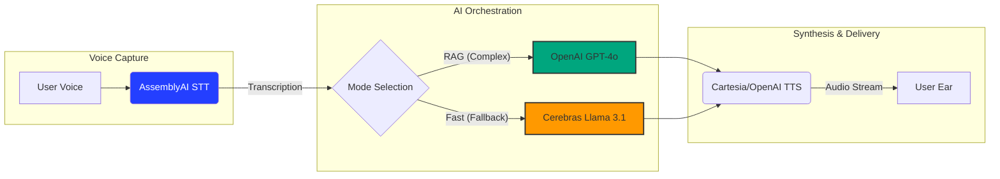

# AI⟡Debate 

<div align="center">


**Your Real-Time AI Opponent for Philosophical Arguments**

[Explore Features](#-features) • [Quick Start](#-quick-start) • [Tech Stack](#-technology-stack) • [Model Orchestration](#-model-orchestration)

</div>

---

<details>
<summary><b>Table of Contents (Click to expand)</b></summary>

- [About AI Debate](#ai-debate)
- [Current Status](#-current-status)
- [Architecture](#%EF%B8%8F-architecture)
- [The Hot-Path (Latency Optimization)](#-the-hot-path-latency-optimization)
- [Model Orchestration](#-model-orchestration)
- [Quick Start](#-quick-start)
  - [Prerequisites](#prerequisites)
  - [Installation](#installation)
- [Enhanced Features](#-enhanced-features)
  - [Settings Panel](#-settings-panel)
  - [Knowledge Base Management](#-knowledge-base-management)
  - [AI Provider Options](#-ai-provider-options)
  - [Voice Settings](#-voice-settings)
- [API Endpoints](#-api-endpoints)
- [Features](#-features)
- [Technology Stack](#-technology-stack)
- [Project Structure Details](#-project-structure-details)
- [Testing](#-testing)
- [License](#-license)

</details>

---

AI Debate is a real-time, browser-based platform where you can argue your ideas and the AI will push back with sharp, curated philosophical counter-arguments. Powered by a structured knowledge base and Retrieval-Augmented Generation (RAG).

The aim was to create an AI opponent that **evolves with you, sharpening its arguments and, in turn, your intellect, the longer you engage.**

## 🚀 Current Status

The project is fully functional, with all core features for real-time, RAG-powered philosophical debates implemented. Additionally, it now includes an enhanced settings panel with advanced knowledge base management, AI provider options, and improved citation capabilities.

### 🎯 Latest Enhancements

- **Enhanced Settings Panel**: Modern, slide-in settings with four main tabs
- **Local Knowledge Base**: Upload and manage custom documents (PDF, TXT, MD)
- **AI Provider Switching**: Toggle between local RAG and Cerebras AI
- **Advanced Citations**: Comprehensive source information with expandable details
- **Live Transcription**: Real-time markdown-formatted conversation viewer
- **Redis Caching**: Optional performance optimization for embeddings

## ️ Architecture

```text
ai-debate-partner/
├── backend/                 # Python FastAPI backend
│   ├── main.py              # FastAPI server and routes
│   ├── config.py            # Configuration management
│   ├── agents/              # LiveKit agents for real-time voice
│   ├── services/            # Business logic (RAG & LLM Orchestration)
│   └── uploaded_documents/  # Local document storage
├── frontend/                # HTML/CSS/JavaScript frontend
│   ├── index.html           # Main application page
│   └── script.js            # Frontend logic
└── README.md                # This file
```

## ⚡ The Hot-Path (Latency Optimization)

To achieve a natural, "no-lag" conversation, the data follows this high-speed pipeline. By minimizing hops between the transcription and the response, we maintain a human-like cadence.



##  Model Orchestration

To balance intellectual depth with real-time performance, the system utilizes a dynamic routing strategy:

* **Knowledge-Deep Mode (RAG):** When a user utilizes a personal knowledge base, the system defaults to **GPT-4o**. It uses **Open Sentence Transformers** (`all-MiniLM-L6-v2`) to vectorize documents into a **FAISS** index, allowing the AI to cite specific philosophical texts.
* **Performance Mode (Fallback):** If no RAG context is required, the system routes queries to **Cerebras AI**. By leveraging Llama 3.1 on Cerebras' specialized hardware, the agent provides near-instantaneous counter-arguments to keep the debate fluid.

---

## 🔧 Enhanced Features

### 📋 Settings Panel
A modern, slide-in settings panel accessible from the top-left corner with four main tabs:
- **Knowledge Base** - Upload and manage custom documents
- **AI Provider** - Switch between local RAG and Cerebras AI
- **Voice Settings** - Configure OpenAI TTS voices
- **Live Transcription** - View real-time markdown-formatted transcriptions

### 📚 Knowledge Base Management

#### Document Upload
- Upload PDF, TXT, and MD files to enhance the AI's philosophical knowledge
- Automatic text extraction and intelligent chunking
- Vector embeddings generated and stored in local FAISS index
- Document metadata saved to local JSON files

#### Features
- View list of uploaded documents with file sizes
- Delete uploaded documents individually
- All data stored locally (no external database required)
- Documents are immediately available for RAG queries

### ⚡ AI Provider Options

#### Cerebras AI Integration
Fast inference alternative to local RAG:
1. Sign up for [Cerebras AI](https://cerebras.ai/)
2. Get your API key
3. In settings → AI Provider → Select "Cerebras AI"
4. Enter your API key
5. Enjoy ultra-fast inference speeds

**Benefits:**
- Significantly faster response times
- No local embedding computation needed
- Works without uploaded knowledge base
- Easy toggle between RAG and Cerebras

### 🎤 Voice Settings

**Current Voice:**
- Nova - Energetic, friendly voice (currently active)

**Available Voices:** (Easy to switch via configuration)
- Alloy - Balanced, neutral voice
- Echo - Warm, engaging voice
- Fable - Expressive, animated voice
- Onyx - Deep, authoritative voice
- Nova - Energetic, friendly voice
- Shimmer - Bright, clear voice

**Note:** Voice selection is configurable in the backend. Future versions will include dynamic voice switching through the settings panel.

Voice preference is saved locally and applies to all voice sessions.

### 📝 Live Transcription Viewer
Monitor voice conversations in real-time:
- **Real-time updates** - See transcription as it happens
- **Markdown formatting** - Properly formatted text with emphasis and structure
- **Speaker identification** - Clear distinction between user and AI
- **Timestamps** - Precise timing for each utterance
- **Auto-scroll control** - Pause to review, resume to follow

### 🔗 Advanced Citation System
Citations now include comprehensive source information:
- **Source document name** with page numbers
- **Content excerpts** for context
- **Expandable details** with hover tooltips
- **Grouped citations** by source document
- **Inline references** with superscript numbers

---

## 🔧 Technology Stack

| Layer | Technology | Role |
| :--- | :--- | :--- |
| **Backend** | FastAPI / Uvicorn | Asynchronous core for handling voice and RAG logic. |
| **Real-time Voice** | LiveKit & Agents | Low-latency WebRTC infrastructure. |
| **STT** | AssemblyAI | Real-time Speech-to-Text streaming. |
| **TTS** | Cartesia / OpenAI | Ultra-fast Text-to-Speech synthesis. |
| **LLM (Reasoning)** | OpenAI GPT-4o | Primary engine for complex RAG and citations. |
| **LLM (Inference)** | Cerebras (Llama 3.1) | Lightning-fast fallback for non-RAG debates. |
| **Embeddings** | Sentence Transformers | Local vectorization of user-uploaded documents. |
| **Vector Store** | FAISS | High-efficiency similarity search for context. |
| **Frontend** | Vanilla JS / CSS | Minimalist, immersive "Zen" interface. |

---

## 🚀 Quick Start

### Prerequisites
- Python 3.10+
- `pip` package manager

### Installation

1. **Clone the repository:**
   ```bash
   git clone [https://github.com/nadinev6/aidebate.git](https://github.com/nadinev6/aidebate.git)
   cd ai-debate-partner
   ```

2. **Set up backend:**
   ```bash
   cd backend
   pip install -r requirements.txt
   pip install --upgrade livekit livekit-plugins-vad
   ```

3. **Set up frontend:**
   ```bash
   npm install
   ```

4. **Configure environment:**
   ```bash
   cp .env.example .env
   # Add your API keys: OPENAI_API_KEY, CEREBRAS_API_KEY, ASSEMBLYAI_API_KEY, etc.
   ```

5. **Prepare the knowledge base:**
   ```bash
   python backend/knowledge_base/prepare_knowledge_base.py
   ```

6. **Run the application:**
   * Start the main backend server: `python main.py`
   * Start the frontend: `npm run dev`
   * Access the application: `http://localhost:5173`

---

## 🔌 API Endpoints

### Voice Session Management
```http
POST /api/voice/start-session
Body: { "user_identity": "username" }

GET /api/voice/session/{session_id}

DELETE /api/voice/session/{session_id}

GET /api/voice/sessions
```

### Knowledge Base Management
```http
POST /api/knowledge/upload
Content-Type: multipart/form-data

DELETE /api/knowledge/document/{doc_id}
```

### Cache Management
```http
POST /api/cache/enable
Body: { "redis_url": "redis://localhost:6379" }

POST /api/cache/disable

GET /api/cache/stats

POST /api/cache/clear
```

---

## 🧪 Testing

### Backend Testing
```bash
cd backend
python -m pytest tests/ -v
```

### Feature Testing
1. **Test Upload Document:**
   - Click settings icon
   - Navigate to "Knowledge Base" tab
   - Click "Upload Documents"
   - Select a PDF, TXT, or MD file
   - Wait for processing confirmation

2. **Test AI Provider Switching:**
   - Open settings → "AI Provider"
   - Select "Cerebras AI" radio button
   - Enter API key
   - Send a message to test faster response times

3. **Test Voice Settings:**
   - Open settings → "Voice Settings"
   - Select a voice from dropdown
   - Start a voice session
   - AI responds with selected voice

4. **Test Live Transcription:**
   - Open settings → "Live Transcript"
   - Start a voice session
   - Speak to the AI
   - See real-time transcription appear
   - Test pause/resume auto-scroll
```

## 📝 License

Distributed under the MIT License. 
**Copyright © Nadine van der Haar 2025**

<div align="center">
  <b>Built for the AssemblyAI Hackathon</b> 🚀
</div>