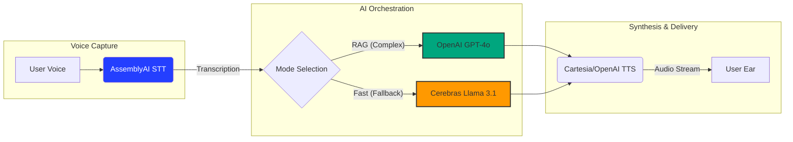

# AI⟡Debate 

<div align="center">


**Your Real-Time AI Opponent for Philosophical Arguments**

[Explore Features](#-features) • [Quick Start](#-quick-start) • [Tech Stack](#-technology-stack) • [Model Orchestration](#-model-orchestration)

</div>

---

<details>
<summary><b>Table of Contents (Click to expand)</b></summary>

- [About AI Debate](#ai-debate)
- [Current Status](#-current-status)
- [Architecture](#%EF%B8%8F-architecture)
- [The Hot-Path (Latency Optimization)](#-the-hot-path-latency-optimization)
- [Model Orchestration](#-model-orchestration)
- [Quick Start](#-quick-start)
  - [Prerequisites](#prerequisites)
  - [Installation](#installation)
- [API Endpoints](#-api-endpoints)
- [Features](#-features)
- [Technology Stack](#-technology-stack)
- [Project Structure Details](#-project-structure-details)
- [Testing](#-testing)
- [License](#-license)

</details>

---

AI Debate is a real-time, browser-based platform where you can argue your ideas and the AI will push back with sharp, curated philosophical counter-arguments. Powered by a structured knowledge base and Retrieval-Augmented Generation (RAG).

The aim was to create an AI opponent that **evolves with you, sharpening its arguments and, in turn, your intellect, the longer you engage.**

## 🚀 Current Status

The project is fully functional, with all core features for real-time, RAG-powered philosophical debates implemented. Additionally, it now includes an enhanced settings panel with advanced knowledge base management, AI provider options, and improved citation capabilities.

## 🏗️ Architecture

```text
ai-debate-partner/
├── backend/                 # Python FastAPI backend
│   ├── main.py              # FastAPI server and routes
│   ├── config.py            # Configuration management
│   ├── agents/              # LiveKit agents for real-time voice
│   ├── services/            # Business logic (RAG & LLM Orchestration)
│   └── uploaded_documents/  # Local document storage
├── frontend/                # HTML/CSS/JavaScript frontend
│   ├── index.html           # Main application page
│   └── script.js            # Frontend logic
└── README.md                # This file
```

## ⚡ The Hot-Path (Latency Optimization)

To achieve a natural, "no-lag" conversation, the data follows this high-speed pipeline. By minimizing hops between the transcription and the response, we maintain a human-like cadence.



##  Model Orchestration

To balance intellectual depth with real-time performance, the system utilizes a dynamic routing strategy:

* **Knowledge-Deep Mode (RAG):** When a user utilizes a personal knowledge base, the system defaults to **GPT-4o**. It uses **Open Sentence Transformers** (`all-MiniLM-L6-v2`) to vectorize documents into a **FAISS** index, allowing the AI to cite specific philosophical texts.
* **Performance Mode (Fallback):** If no RAG context is required, the system routes queries to **Cerebras AI**. By leveraging Llama 3.1 on Cerebras' specialized hardware, the agent provides near-instantaneous counter-arguments to keep the debate fluid.

---

## 🔧 Technology Stack

| Layer | Technology | Role |
| :--- | :--- | :--- |
| **Backend** | FastAPI / Uvicorn | Asynchronous core for handling voice and RAG logic. |
| **Real-time Voice** | LiveKit & Agents | Low-latency WebRTC infrastructure. |
| **STT** | AssemblyAI | Real-time Speech-to-Text streaming. |
| **TTS** | Cartesia / OpenAI | Ultra-fast Text-to-Speech synthesis. |
| **LLM (Reasoning)** | OpenAI GPT-4o | Primary engine for complex RAG and citations. |
| **LLM (Inference)** | Cerebras (Llama 3.1) | Lightning-fast fallback for non-RAG debates. |
| **Embeddings** | Sentence Transformers | Local vectorization of user-uploaded documents. |
| **Vector Store** | FAISS | High-efficiency similarity search for context. |
| **Frontend** | Vanilla JS / CSS | Minimalist, immersive "Zen" interface. |

---

## 🚀 Quick Start

### Prerequisites
- Python 3.10+
- `pip` package manager

### Installation

1. **Clone the repository:**
   ```bash
   git clone [https://github.com/nadinev6/aidebate.git](https://github.com/nadinev6/aidebate.git)
   cd ai-debate-partner
   ```

2. **Set up backend:**
   ```bash
   cd backend
   pip install -r requirements.txt
   pip install --upgrade livekit livekit-plugins-vad
   ```

3. **Configure environment:**
   ```bash
   cp .env.example .env
   # Add your API keys: OPENAI_API_KEY, CEREBRAS_API_KEY, ASSEMBLYAI_API_KEY, etc.
   ```

4. **Prepare the knowledge base:**
   ```bash
   python backend/prepare_knowledge_base.py
   ```

5. **Run the application:**
   * Start the main backend server: `python main.py`
   * Start the LiveKit debate agent: `python agents/debate_agent.py dev`

---

## 🧪 Testing

```bash
cd backend
python -m pytest tests/ -v
```

## 📝 License

Distributed under the MIT License. 
**Copyright © Nadine van der Haar 2025**

<div align="center">
  <b>Built for the AssemblyAI Hackathon</b> 🚀
</div>